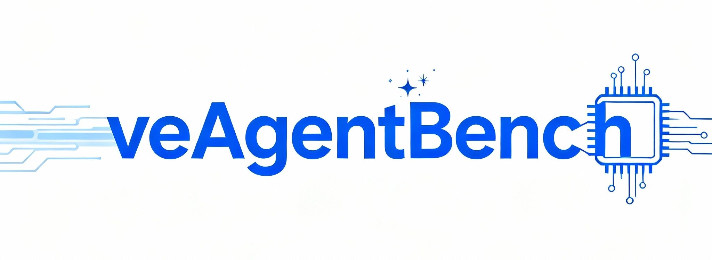

# veAgentBench

<a href="https://huggingface.co/datasets/bytedance-research/veAgentBench" target="_blank">
    
</a>



**veAgentBench** is a professional evaluation framework for AI Agent ecosystems, featuring built-in evaluation tools and datasets. It provides core capabilities including LLM judge scoring, multi-dimensional metric analysis, and tool call matching, along with a complete end-to-end analytical reporting system to help build trustworthy agent evaluation systems.

> **📖 中文版本** | [查看中文文档](./README.zh-CN.md)

## 🚀 Latest Release

[2025/11/12] 🔥 **veAgentBench Officially Open Sources Tools + Evaluation Datasets** - Enterprise-grade AI Agent Evaluation Solution

## Project Introduction

### 🎯 Core Advantages

- **Multi-dimensional Evaluation System**: Integrates comprehensive metrics including LLM judge scoring, tool matching accuracy, and response quality
- **Deep Metric Analysis**: Provides fine-grained performance breakdown and intermediate metric visibility
- **Visualized Reporting**: Automatically generates professional analysis reports with multi-format output support
- **High-performance Architecture**: Supports concurrent evaluation with optimized assessment efficiency
- **Flexible Extension**: Modular design supporting custom evaluation metrics and dimensions
- **Multiple Evaluation Target Support**: Local development objects, HTTP+SSE, A2A

### Built-in Evaluation Datasets

Comes with evaluation data for legal, education, financial analysis, and personal assistant domains, supporting one-click reference evaluation. For detailed dataset information, see: [veAgentBench-data](https://huggingface.co/datasets/bytedance-research/veAgentBench)

## Quick Start

### Environment Requirements

- **Python**: 3.10+
- **Environment Management**: Virtual environments recommended
- **Dependency Management**: Supports mainstream tools like uv/pip

### Installation

```bash
pip install git+https://code.byted.org/iaas/veAgentBench.git
```

### Command Line Usage Guide

#### View Help Information

```bash
veagentbench --help
```

#### View Basic Information

```bash
# View available metrics
veagentbench info --metrics

# View available agents
veagentbench info --agents

# View configuration template types
veagentbench info --templates
```

#### Generate Basic Configuration

```bash
veagentbench config generate --task-name my_test --output my_config.yaml
```

#### Parallel Execution (Default)

```bash
veagentbench run --config my_config.yaml --parallel
```

#### Sequential Execution

```bash
veagentbench run --config my_config.yaml --sequential
```

### Configuration File Guide

```yaml
tasks:
  - name: legal_assistant    # Evaluation task name
    datasets:
      - name: bytedance-research/veAgentBench   # Dataset name
        description: Legal Aid Assistant                 # Dataset description
        property:                               # Dataset-related properties
          type: huggingface                     # Dataset type, supports csv, huggingface
          config_name: legal_aid   
          split: "test[:1]"        
          input_column: "input"
          expected_output_column: "expect_output"
    metrics:                                    # Evaluation metrics
      - AnswerCorrectnessMetric
    judge_model:                   # Judge model configuration
      model_name: "gpt-4"          # Model name
      base_url: "https://api.openai.com/v1"  # OpenAPI base_url
      api_key: "your_api_key"      # API key (needs replacement)
    agent:                         # Agent under test configuration
      type: AdkAgent              # Agent type under test: AdkAgent/LocalAdkAgent/A2AAgent
      property:
        agent_name: "financial_analysis_agent"  # Agent name
        end_point: "http://127.0.0.1:8000/invoke"  # Call endpoint
        api_key: "your_api_key"     # Agent API key (needs replacement)
    max_concurrent: 5              # Concurrent calls to agent under test
    measure_concurrent: 100        # Evaluation concurrency: 100 samples
    cache_dir: "./cache"           # Cache directory path
```

#### Dataset Configuration Guide

##### HuggingFace Dataset Configuration

```yaml
    datasets:
      - name: bytedance-research/veAgentBench   # HuggingFace dataset name
        description: Financial Analysis Test Set
        property:
          type: huggingface                    # Dataset type
          config_name: financial_analysis      # Subset name
          split: "test[:1]"                    # Split, can be left blank. Specify if running few cases
          input_column: "input"                 # Input column name
          expected_output_column: "expect_output"   # Expected response column name
          expected_tool_call_column: "expected_tool_calls"  # Expected tool call column name
```

##### Local CSV File Dataset Configuration

```yaml
    datasets:
      - name: legal                     # Dataset name
        description: Legal Consultation Customer Service Evaluation Set    # Dataset description
        property:
          type: csv                     # Dataset type
          csv_file_path: "dataset/test1.csv"       # Local dataset file
          input_column: "input"                    # Input column name
          expected_output_column: "expect_output"   # Expected response column name
          expected_tool_call_column: "expected_tool_calls"    # Expected tool call column name
```

#### Agent Under Test Configuration Guide

##### Agentkit Platform Agent Integration

```yaml
    agent:                         # Agent under test configuration
      type: AdkAgent              # Agent type under test: AdkAgent/LocalAdkAgent/A2AAgent
      property:
        agent_name: "financial_analysis_agent"  # Agent name
        end_point: "http://127.0.0.1:8000/invoke"  # Call endpoint
        api_key: "your_api_key"     # Agent API key (needs replacement)
```

##### Local Agentkit-developed Agent Object

```yaml
  agent:
    type: LocalAdkAgent   
    property:
      agent_name: local_finantial_agent  
      agent_dir_path: "agents/legal"        # Local agent object directory
```

### Offline Evaluation

Offline evaluation is suitable for scenarios with existing evaluation data, ideal for pre-launch effectiveness validation.

#### Built-in Benchmark Evaluation Dataset Evaluation

veAgentBench provides built-in evaluation datasets covering multiple professional domains:

**1. Prepare Evaluation Configuration**

Prepare evaluation configuration test_config.yaml, reference examples below:

**Financial Analysis Evaluation Configuration:**

```yaml
tasks:
  - name: financial_analysis_test
    datasets:
      - name: bytedance-research/veAgentBench   # HuggingFace dataset name
        description: Financial Analysis Test Set
        property:
          type: huggingface
          config_name: financial_analysis      # Subset name
          split: "test[:1]"                    # Split, can be left blank. Specify if running few cases
          input_column: "input"
          expected_output_column: "expect_output"
          expected_tool_call_column: "expected_tool_calls"
    metrics: ["MCPToolMetric"]
    judge_model:                   # Judge model configuration
      model_name: "gpt-4"          # Model name
      base_url: "https://api.openai.com/v1"  # OpenAPI base_url
      api_key: "your_api_key"      # API key (needs replacement)
    agent:                         # Agent under test configuration
      type: AdkAgent              # Agent type under test: AdkAgent/LocalAdkAgent/A2AAgent
      property:
        agent_name: "financial_analysis_agent"  # Agent name
        end_point: "http://127.0.0.1:8000/invoke"  # Call endpoint
        api_key: "your_api_key"     # Agent API key (needs replacement)
    max_concurrent: 5              # Concurrent calls to agent under test
    measure_concurrent: 100        # Evaluation concurrency: 100 samples
    cache_dir: "./cache"           # Cache directory path
```

**Legal Aid Evaluation Configuration:**

```yaml
tasks:
  - name: legal_assistant
    datasets:
      - name: bytedance-research/veAgentBench   # HuggingFace dataset name
        description: Legal Aid Assistant
        property:
          type: huggingface
          config_name: legal_aid       # Subset name
          split: "test[:1]"                    # Split, can be left blank. Specify if running few cases
          input_column: "input"
          expected_output_column: "expect_output"
    metrics:
      - AnswerCorrectnessMetric
      - AnswerRelevancyMetric
      - ContextualPrecisionMetric
      - ContextualRecallMetric
      - FaithfulnessMetric
      - ContextualRelevancyMetric
    judge_model:                   # Judge model configuration
      model_name: "gpt-4"          # Model name
      base_url: "https://api.openai.com/v1"  # OpenAPI base_url
      api_key: "your_api_key"      # API key (needs replacement)
    agent:                         # Agent under test configuration
      type: AdkAgent              # Agent type under test: AdkAgent/LocalAdkAgent/A2AAgent
      property:
        agent_name: "financial_analysis_agent"  # Agent name
        end_point: "http://127.0.0.1:8000/invoke"  # Call endpoint
        api_key: "your_api_key"     # Agent API key (needs replacement)
    max_concurrent: 5              # Concurrent calls to agent under test
    measure_concurrent: 100        # Evaluation concurrency: 100 samples
    cache_dir: "./cache"           # Cache directory path
```

**2. Prepare Agent Under Test**

Refer to the corresponding agent files at [veAgentBench-agent](https://huggingface.co/datasets/bytedance-research/veAgentBench/tree/main/agents), develop locally or deploy to Volcano agentkit platform for evaluation.

**3. Execute Test Command**

```bash
veagentbench run --config test_config.yaml  --parallel
```

#### Custom Dataset Evaluation

Supports users to evaluate with their own datasets, flexibly adapting to various business scenarios:

**1. Data Format Requirements**

- **CSV Format**: Supports local CSV files containing input, expected output, expected tool calls and other columns
- **HuggingFace Format**: Supports loading datasets from HuggingFace Hub

**2. Configure Custom Dataset**

```yaml
# CSV dataset configuration example, generally requires input_column, expected_output_column
datasets:
  - name: custom_testset
    property:
      type: csv  # Dataset type: csv/huggingface/trace
      csv_file_path: "path/to/your/dataset.csv"  # Data file path
      input_column: "question"  # Input column name
      expected_output_column: "expected_answer"  # Expected output column name
      expected_tool_call_column: "expected_tools"  # Expected tool call column name
```

**3. Execute Test Command**

```bash
veagentbench run --config test_config.yaml  --parallel
```

### Online Evaluation (Reserved)

Online evaluation functionality is under development and will support real-time Agent calls for dynamic assessment, suitable for online agent performance monitoring scenarios.

**Upcoming Features:**

- 🔌 Real-time Agent calling and evaluation
- 📊 Dynamic performance monitoring
- ⚡ Development debugging support
- 🔄 Continuous integration integration
- 📈 Real-time metric display

## 🗺️ Product Roadmap

### Near-term Plans

- [ ] Expand Agent framework support (LangChain, AutoGPT, etc.)
- [ ] Add domain-specific evaluation metrics (finance, medical, legal, etc.)
- [ ] Optimize evaluation performance and concurrent processing capabilities
- [ ] Improve visualization analysis features

### Long-term Vision

- [ ] Support distributed evaluation architecture
- [ ] Establish industry standard evaluation system

## 🤝 Contributing

We welcome community developers to participate in veAgentBench development:

- 📋 Submit Issues for feedback and suggestions
- 🔧 Contribute code and documentation improvements
- 📊 Share use cases and best practices
- 💡 Propose new feature requirements

## 📄 Open Source License

Open source under **Apache 2.0** license - see [LICENSE](LICENSE)

---

**veAgentBench** - Professional, Trustworthy, and Efficient AI Agent Evaluation Framework
